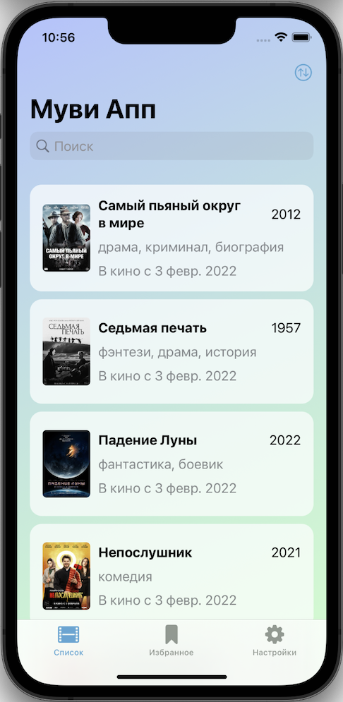
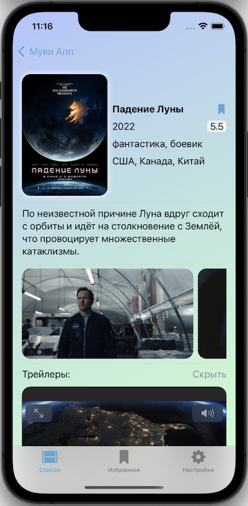
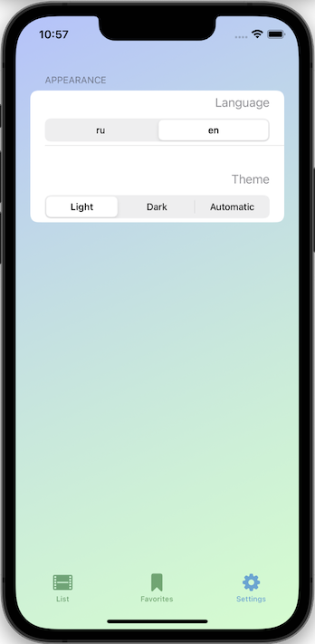

# MoviesApp

A simple iOS application written in SwiftUI using the Combine framework.

The application shows the latest premieres in cinemas with descriptions, screenshots and video trailers. It is also possible to sort, search and save to favorites.

## Features

- Light/Dark/Default mode toggle
- Ru/En language toggle
- Movie details info
- Play available trailers
- Save in favorite

## Before Run

The application uses a free unofficial kinopoisk.ru API that provides access to site data. For access, you must receive a token, which will be available after registration at https://kinopoiskapiunofficial.tech and put it in the file MoviesApp/Service/ApiService.swift

## Screenshots

  
   
  

